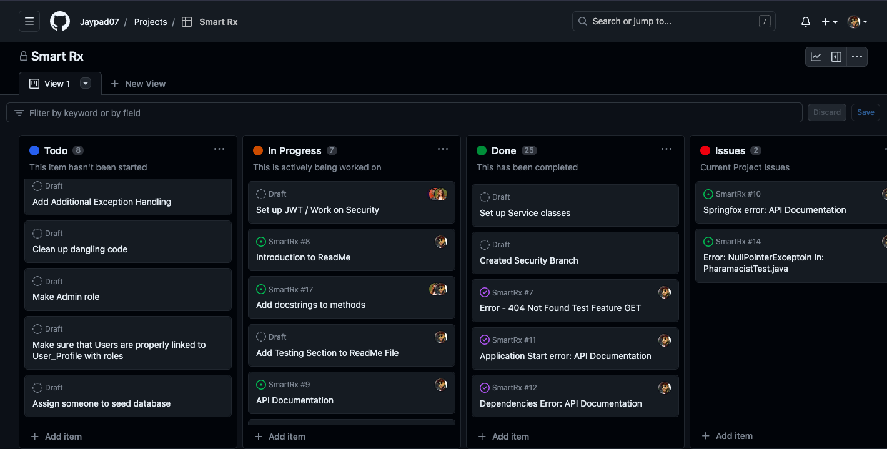
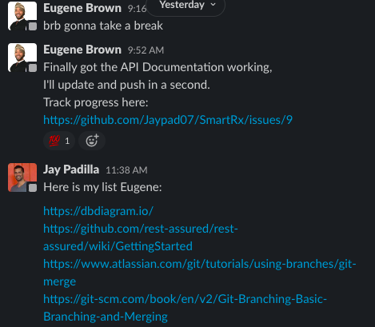
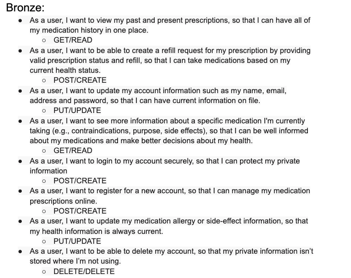
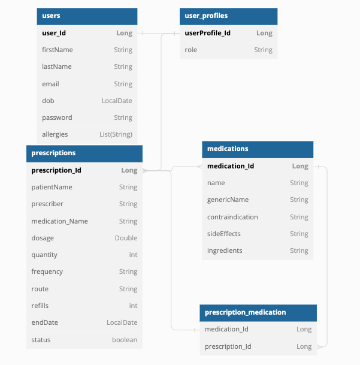
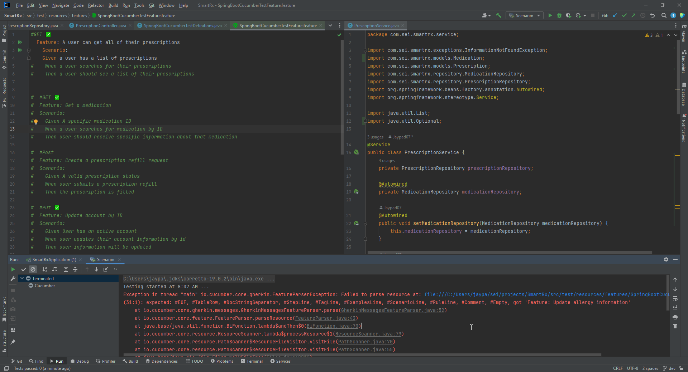
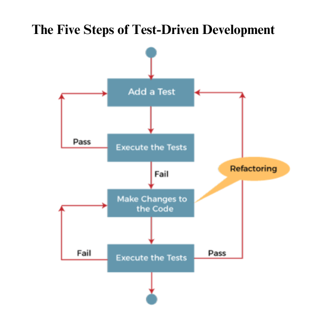

# SmartRx

### Description
SmartRx REST API backend is a Java and Spring Boot application that provides a robust and scalable solution for managing prescription and medication data. It serves as a reliable and efficient backend system to support various client applications such as web, mobile, or desktop applications.

## Table of Contents
- Product Overview
- Key Features
- General Approach
- Planning Documentation
- User Stories
- ERD Diagram
- Unsolved Problems & Hurdles Tackled
- Testing (TDD Process)
- Tools and Technologies
- API Endpoints - User
- API Endpoints - Pharmacist
- Usage
- Installation Instructions for Dependencies
- How To Install and Run this Application on your own Machine
- Contributing
- Credits
- References
- 


## Product Overview
### Key Product Features
##### CRUD Operations:
SmartRx allows users to perform Create, Read, Update, and Delete (CRUD) operations on prescription and medication data. Users can create new prescriptions, retrieve prescription details, update existing prescriptions, and delete prescriptions as needed.

##### Authentication and Authorization
SmartRx implements secure authentication and authorization mechanisms to ensure that only authorized users can access the protected endpoints. It enables user registration, login, and generates JSON Web Tokens (JWT) to authenticate and authorize API requests.

##### Validation and Error Handling:
SmartRx performs thorough validation of incoming data to ensure its integrity and consistency. It provides appropriate error responses with detailed error messages and status codes when invalid requests or exceptions occur, improving the user experience.

##### Testing and Quality Assurance:
SmartRx also includes a suite of unit tests and integration tests to validate the functionality and behavior of the API. It follows coding best practices, adheres to code style guidelines, and undergoes rigorous testing to ensure high-quality and reliable software.


### General Approach
In our development process, we have adopted an agile approach with a focus on collaboration and iterative development. We have been utilizing pair programming extensively, both in duos and as a quad, to leverage the collective skills and expertise of our team members. We utilize Kanban as our project management framework to enhance our workflow and improve overall efficiency.

Here are some key aspects of our general approach:

1. Kanban Board: We maintain a Kanban board to visualize our workflow and track the progress of tasks. The board consists of columns representing different stages of the development cycle, such as "To Do," "In Progress," "Review," and "Done." This board helps us visualize the work in progress and maintain a smooth flow of tasks.

2. Collaborative Environment: We foster a collaborative environment where every team member actively participates and contributes to the project. Pair programming allows us to work closely together, share knowledge, and make collective decisions.


3. Rotation and Diversity: We rotate pairs regularly to ensure that everyone gets a chance to work with different team members. This helps us leverage diverse perspectives, cross-pollinate ideas, and build a strong sense of camaraderie within the team.


4. Clear Goals and Objectives: Each pairing session has clear goals and objectives. We define specific tasks or features to work on during the session, ensuring that we stay focused and aligned with the project requirements.

5. Roles and Responsibilities: Within each pair or quad, we assign roles and responsibilities. We have a designated driver who actively writes the code, while the navigator provides guidance, reviews the code, and ensures adherence to best practices. We periodically rotate these roles to promote equal participation and knowledge sharing.


6. Effective Communication: Communication is vital in our pairing sessions. We engage in open and frequent communication, discussing ideas, brainstorming solutions, and seeking clarifications. We value active listening and constructive feedback, which enables us to make informed decisions and deliver high-quality code.


7. Continuous Learning: Pair programming serves as a platform for continuous learning and skill development. We actively share insights, coding techniques, and best practices with each other. This collaborative learning environment helps us grow individually and as a team.


8. Code Reviews and Quality Assurance: We prioritize code reviews within the team. Each pair or quad conducts code reviews, providing feedback and suggestions for improvement. This practice ensures code quality, adherence to coding standards, and helps identify and resolve any issues early in the development process.


9. Adaptability and Agility: We value adaptability and embrace changes throughout the development process. We regularly reflect on our progress, discuss lessons learned, and make adjustments to our approach as needed. This iterative mindset allows us to respond to evolving project requirements effectively.


### Planning Documentation

#### User Stories


#### ERD Diagram


##### External Links to Planning Documents
- [Link to Planning and Schedule]()
- [Link to ERD DIAGRAM]()
- [Link to User Stories]()

#### Unsolved Problems and Hurdles Tackled



## Test Driven Development (TDD)

This project follows the Test Driven Development (TDD) approach to ensure the reliability and correctness of the codebase. TDD involves writing tests before implementing the actual code logic.

Here's an overview of the TDD process followed in this project:


1. **Write Tests**: Tests are written in the form of Cucumber feature files using Gherkin syntax. Each feature file describes a specific functionality or scenario to be tested. Test scenarios are written in a user-friendly language that captures the expected behavior of the system.

2. **Run Tests**: The Cucumber tests are executed using the TestRunner and Test Definitions. These files contain the necessary configurations and definitions for running the tests. Tests can be run locally or integrated with a CI/CD system for automated testing on each code commit.

3. **Implement Code**: After writing the tests, the corresponding code implementation is done to make the tests pass. The implementation follows the principles of SOLID design and clean code practices. The tests act as a guide to ensure that the code meets the desired functionality.

4. **Refactor Code**: Once the tests pass, the code is refactored to improve its design, readability, and maintainability. Refactoring involves making changes to the code without altering its behavior. The goal is to enhance the code's structure, eliminate duplication, and improve overall code quality.

5. **Re-run Tests**: After refactoring the code, the tests are re-run to ensure that the changes have not introduced any regressions or unexpected behavior. This step verifies that the code still adheres to the desired functionality defined by the tests.


### Tools and Technologies
- Java
- Spring Boot
- Spring MVC
- Spring Security
- Spring Data JPA
- Hibernate
- Git
- Junit
- Maven
- IntelliJ IDEA


### API Endpoints - User

| Name        | API Endpoint         | HTTP Verb | Purpose           |
|-------------|----------------------|-----------|-------------------|
| Create User | /auth/users/register | POST      | Create a new User |
| Login User  | /auth/users/login    | POST      | Logs in a User    | 
| Show User   | /users               | GET       | Displays a User   |
| Update User | /users               | PUT       | Displays a User   |
| Delete User | /users               | DELETE    | Displays a User   |


### API Endpoints - Pharmacist

| Name                      | API Endpoint                                   | HTTP Verb | Purpose                              |
|---------------------------|------------------------------------------------|-----------|--------------------------------------|
| List User's Prescriptions | /api/prescriptions                             | GET       | Gets a list of a Users Prescriptions |
| Individual Prescription   | /api/newRequest/prescriptions/1                | GET       | Gets a single Users Prescription     | 
| Get all prescriptions     | /api/pharmacist/prescriptions                  | GET       | Gets all prescriptions               |
| Get one medication        | /api/prescriptions/medications/{medicationId}  | GET       | Gets a specific medication by Id     |
| Get Specific Prescription | /api/pharmacist/prescriptions/{prescriptionId} | GET       | Gets a Specific Prescription by Id   |


### Installation Instructions For Dependencies 
1. Open your project in an IDE or navigate to the project directory using the command line.
2. Locate the pom.xml file in the root directory of your project.
3. Open the pom.xml file and locate the <dependencies> section.
4. Copy the dependency block for each dependency mentioned above and paste it inside the <dependencies> section of your pom.xml file.
5. Save the pom.xml file.
6. Build the project to resolve and download the dependencies by running one of the following commands:

- If you are using an IDE like Eclipse or IntelliJ IDEA, you can use the IDE's build or compile command to resolve the dependencies.
- If you are using the command line, navigate to the project directory and run the command mvn clean install. This will trigger the Maven build process and download the dependencies specified in the pom.xml file.
7. Wait for the build process to complete. Maven will download the required dependencies from the Maven Central Repository or other specified repositories.
8. Once the build process is successful, the dependencies should be installed and available for your project to use.

   - Note: If you are using an IDE, it might automatically download the dependencies and update the project configuration. If not, you can manually refresh the project or restart the IDE to ensure that the dependencies are recognized.

### How To Install and Run this Application on your own Machine
To run this application on your local machine, please follow the steps below:

1. Prerequisites

Before proceeding with the installation, ensure that the following prerequisites are met:

- Java Development Kit (JDK) 8 or higher is installed on your machine.
- Apache Maven is installed.
- PostgreSQL database is installed and running.

2. Clone the Repository

Clone the project repository from the GitHub repository using the following command:
```
git clone <repository-url>
```

3. Configure the Database

Open the application.properties file located in the src/main/resources directory. 
Update the database configuration properties according to your PostgreSQL database setup. 
Make sure to provide the correct database URL, username, and password.


4. Build the Application

Navigate to the project's root directory and build the application using Maven. Run the following command:
```
mvn clean install
```

5. Run the Application

After a successful build, run the application using the following command:
```
mvn spring-boot:run
```
The application will start, and you will see the logs indicating the server is up and running.


6. Access the Application

Open your web browser and access the application using the following URL:
```
http://localhost:8080
```
You can now explore and interact with the application.


## Contributing 
We welcome and appreciate contributions from the community! If you're interested in making this project better, you can contribute in several ways. Whether you want to report a bug, suggest a new feature, or submit code improvements, your contributions are valuable to us.

To contribute to this project, please follow the guidelines below:

### Reporting Issues
If you encounter any issues or bugs while using this project, please open an issue on the GitHub repository. When reporting an issue, provide as much detail as possible, including:

- A clear and concise description of the problem
- Steps to reproduce the issue
- Any relevant error messages or screenshots 

### Suggesting Enhancements
If you have an idea to enhance this project or want to propose a new feature, feel free to submit a feature request on the GitHub repository. Clearly describe your suggestion and provide any additional context that might be helpful.

### Making Code Contributions
If you're interested in contributing code to this project, we're thrilled to have your help! Here's how you can get started:

- Fork the repository to your GitHub account.
- Create a new branch for your feature or bug fix.
- Make the necessary changes and ensure that the code follows the project's coding guidelines.
- Write appropriate tests to cover your changes.
- Commit your changes and push them to your forked repository.
- Open a pull request in the main repository and provide a detailed description of your changes.
- Please note that all contributions will be thoroughly reviewed, and constructive feedback may be provided to ensure the quality and compatibility of the codebase.

### Code Style Guidelines
To maintain consistency within the project, please adhere to the following code style guidelines:

- Use clear and descriptive variable and function names.
- Follow the existing code formatting conventions.
- Write concise and informative comments when necessary.
- Write unit tests for new features or modifications to existing code.

### Code of Conduct
We expect all contributors to adhere to the project's Code of Conduct. Please be respectful and considerate of others throughout the process.

Thank you for your interest in contributing to this project! Your contributions are highly appreciated, and together we can make this project even better.


## Credits

We would like to extend our gratitude to the following individuals for their contributions to this project:

- [Edgar Zambrana](https://github.com/EdgarJoell) - [LinkedIn](https://www.linkedin.com/in/edgar-j-zambrana-0b11a31b2/)
- [Lorena Rojas](https://github.com/lrojas4) 
- [Maksym Zinchenko](https://github.com/maklaut007) 

Our Instructors:
- Leo Rodriguez - [LinkedIn](https://www.linkedin.com/in/leonardo-rodriguez/)
- [Suresh Sigera](https://github.com/sureshmelvinsigera) 
- Dhrubo Chowdhury [LinkedIn](https://www.linkedin.com/in/dhrubo-hasan/)

Their dedication and expertise have greatly contributed to the success of this project. We are grateful for their valuable insights and efforts.


## References
[Security Feature Doc Strings](https://docs.spring.io/spring-security/site/docs/current/api/index.html)

[Add JWT to Header for use with RestTemplate](https://stackoverflow.com/questions/20186497/what-is-the-resttemplate-exchange-method-for...and)

[Git Stashing](https://www.gitkraken.com/learn/git/git-stash#:~:text=Git%20Stash%20List&text=The%20Git%20stash%20list%20command,stash%40%20and%20the%20desired%20index)

[Git Merging - Source: Atlassian](https://www.atlassian.com/git/tutorials/using-branches/git-merge)

[Git Branching - Source: git-scm.com](https://git-scm.com/book/en/v2/Git-Branching-Basic-Branching-and-Merging)

[Rest Assured - Source: github.com](https://github.com/rest-assured/rest-assured/wiki/GettingStarted)

[For ERD  - dbdiagram.com](https://dbdiagram.io/)

[HTTP Status Codes - Source: Mozilla.org](https://developer.mozilla.org/en-US/docs/Web/HTTP/Status)

[Cucumber School - Source: Cucumber.io](https://school.cucumber.io/courses/take/bdd-with-cucumber-java/lessons/9588457-add-a-scenario-wire-it-up)

[Gherkin Syntax - Cucumber.io](https://cucumber.io/docs/gherkin/)

[JSON Jwt Tokens - JWT.io](https://jwt.io)